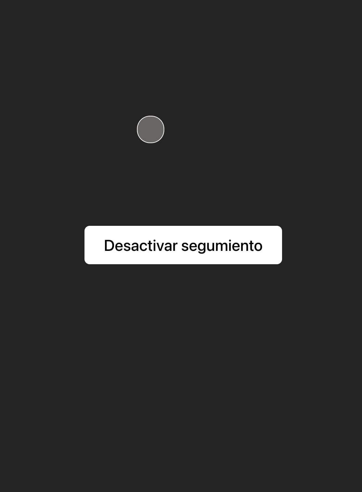

# Mouse Follower (Reactjs)

## Description

This is a simple page build with react using [useStated](https://react.dev/reference/react/useState) and [useEffect](https://react.dev/reference/react/useEffect), with which we will follow the mouse

Demo: [https://mousefollower-react.netlify.app/](https://mousefollower-reactjs.netlify.app)

## Tecnologies
Library: [React](https://react.dev/)

Bundle: [Vite](https://vitejs.dev/)

Deploy: [Netlify](https://www.netlify.com/)
